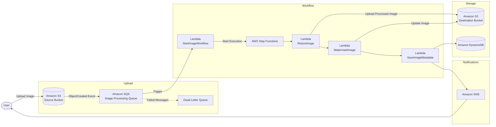

# 📸 AWS Serverless Image Processing Pipeline

A fully serverless, event-driven image processing pipeline built using AWS services.

The project automatically processes uploaded images, resizes them, applies a watermark, stores image metadata, and sends a completion notification.

---

# 🚀 Architecture



---

# 📖 Project Overview

This project demonstrates how to build a fully serverless image processing system using AWS managed services.

Whenever an image is uploaded to the source S3 bucket:

1. Amazon S3 publishes an event.
2. The event is delivered to Amazon SQS.
3. SQS triggers a Lambda function.
4. The Lambda function starts an AWS Step Functions workflow.
5. Images are resized.
6. A watermark is added.
7. Image metadata is stored in DynamoDB.
8. Amazon SNS sends a completion notification.

The project follows an event-driven architecture that is scalable, loosely coupled, and highly available.

---

# 🏗 AWS Services Used

| Service | Purpose |
|----------|----------|
| Amazon S3 | Store original and processed images |
| Amazon SQS | Queue image processing requests |
| Dead Letter Queue | Store failed processing events |
| AWS Lambda | Execute image processing logic |
| AWS Step Functions | Orchestrate the workflow |
| Amazon DynamoDB | Store image metadata |
| Amazon SNS | Send completion notifications |
| CloudWatch | Logging and monitoring |
| Lambda Layers | Package the Pillow image library |

---

# ⚙ Workflow

```
Upload Image
      │
      ▼
Amazon S3
      │
      ▼
Amazon SQS
      │
      ▼
StartImageWorkflow
      │
      ▼
AWS Step Functions
      │
      ▼
ResizeImage
      │
      ▼
WatermarkImage
      │
      ▼
SaveImageMetadata
      │
      ▼
Amazon DynamoDB
      │
      ▼
Amazon SNS
```

---

# 📂 Project Structure

```
.
├── ResizeImage/
├── WatermarkImage/
├── SaveImageMetadata/
├── StartImageWorkflow/
├── diagrams/
├── screenshots/
└── README.md
```

---

# ✨ Features

- Event-driven architecture
- Serverless processing
- Automatic image resizing
- Automatic watermarking
- Metadata storage
- Email notifications
- Dead Letter Queue support
- Step Functions orchestration
- CloudWatch monitoring

---

# 📊 DynamoDB Metadata

Each processed image stores:

- Image ID
- File Name
- Upload Time
- Original Dimensions
- Processed Dimensions
- Image Format
- Processing Status
- Source Bucket
- Destination Bucket
- Object Keys

---

# 📬 Notifications

When processing finishes successfully, Amazon SNS sends an email notification containing:

- File name
- Processing status
- Processed object key

---

# 📈 Scalability

The architecture is designed using AWS managed services, allowing automatic scaling without provisioning servers.

Benefits include:

- High availability
- Loose coupling
- Fault tolerance
- Event-driven processing
- Pay-per-use pricing

---

# 🔮 Future Improvements

The following enhancements are planned for the next version:

- API Gateway
- Pre-signed URL uploads
- Amazon CloudFront
- Retry & Catch in Step Functions
- Automated failure testing
- Image validation
- Thumbnail generation
- Multiple image formats (WebP)

---

# 📸 Screenshots

Add screenshots for:

- AWS Step Functions
- Lambda Functions
- DynamoDB Table
- S3 Buckets
- SNS Email
- CloudWatch Logs

---

# 👨‍💻 Author

Ahmed Ehab

Computer Science Graduate

Junior Data Engineer

AWS Cloud Practitioner
